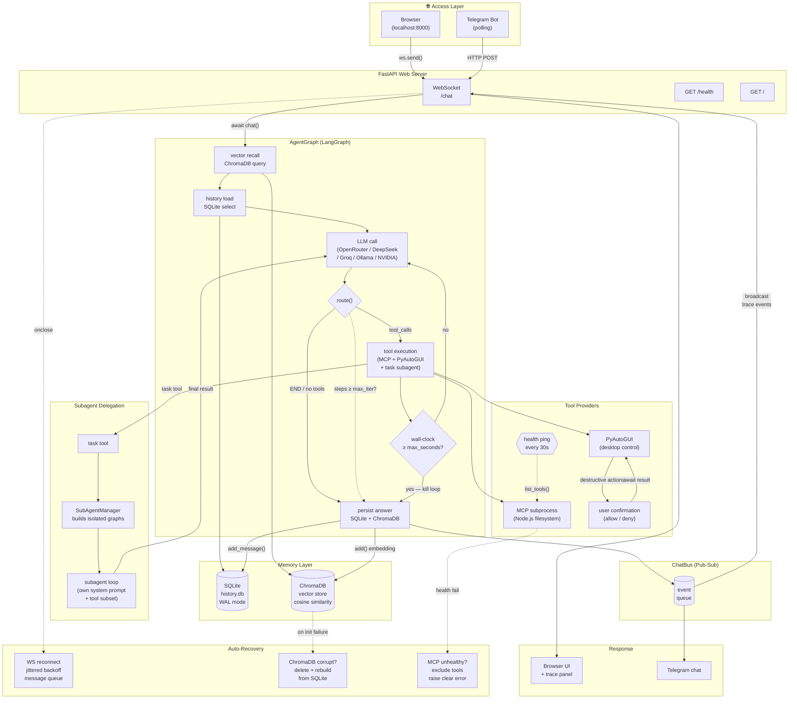

# Personal AI Agent — Project Overview

A **24x7 personal AI assistant** that runs on your local Windows machine. It has eyes
(screenshots), hands (mouse/keyboard control), a memory (SQLite + vector recall),
and you can talk to it through a **web browser** or **Telegram**. It stays alive
across restarts thanks to a process manager that launches it on login.

---

## What It Can Do

| Capability | Description |
|---|---|
| **Chat** | Conversational AI using your choice of cloud or local LLM |
| **Filesystem tools** | List directories, read/write files, search, create, move — all within a sandboxed workspace |
| **Computer control** | Move the mouse, click, double-click, right-click, type text, press keys, use hotkeys, scroll, drag |
| **Screen reading** | Take screenshots and describe what it sees (uses a separate vision model for image understanding) |
| **Web search** | Search the internet for up-to-date information |
| **Persistent memory** | Remembers past conversations — both recent history (SQLite) and semantically relevant old turns (vector search) |
| **Multi-provider access** | Web browser chat UI + Telegram bot, both talking to the same agent |
| **Subagent delegation** | The main agent routes tasks to specialized subagents (filesystem, coding, git, browser, computer_control, general) that run in isolated contexts. Browser, desktop, coding, and git tasks are delegated by default — the main agent rarely touches computer tools directly. |
| **Live trace viewer** | See what the agent is thinking: every LLM call, tool use, and reasoning step in real time |
| **Auto-recovery** | Crashes? PM2 restarts it. DB corrupts? Auto-rebuilds from SQLite. MCP server dies? Detected and reported. WebSocket drops? Auto-reconnects with backoff. |

---

## Architecture at a Glance

```
┌─────────────────────────────────────────────────────────────────┐
│                        Access Layer                              │
│  ┌──────────────────┐              ┌──────────────────┐         │
│  │   Web Browser     │              │    Telegram Bot   │         │
│  │  (localhost:8000) │              │  (polling)        │         │
│  └────────┬─────────┘              └────────┬─────────┘         │
│           │  WebSocket                       │  HTTP             │
│           └──────────┬──────────────────────┘                   │
│                      ▼                                           │
│  ┌─────────────────────────────────────────────┐                │
│  │           FastAPI Web Server                 │                │
│  │     (WebSocket /chat, GET /health, GET /)    │                │
│  └────────────────────┬────────────────────────┘                │
│                       ▼                                          │
├─────────────────────────────────────────────────────────────────┤
│                       Core Layer                                 │
│  ┌─────────────────────────────────────────────┐                │
│  │              AgentGraph (LangGraph)           │                │
│  │                                               │                │
│  │   ┌──────┐   route()   ┌───────┐             │                │
│  │   │ agent │ ──────────→│ tools │             │                │
│  │   │(LLM)  │←───────────│(MCP + │             │                │
│  │   └──────┘             │ pyauto│             │                │
│  │       │                │  gui) │             │                │
│  │       └──→ END (no tool_calls)               │                │
│  └─────────────────────────────────────────────┘                │
│                       │                                          │
│          ┌────────────┼────────────┐                             │
│          ▼            ▼            ▼                             │
│   ┌──────────┐ ┌──────────┐ ┌──────────────┐                    │
│   │  ChatDB   │ │ Vector   │ │  MCPManager   │                    │
│   │ (SQLite)  │ │ (Chroma) │ │ (subprocesses)│                    │
│   └──────────┘ └──────────┘ └──────────────┘                    │
├─────────────────────────────────────────────────────────────────┤
│                      Infrastructure                              │
│   ┌─────────┐  ┌─────────────────────────────────────┐          │
│   │   PM2    │  │  pm2_startup.vbs (Windows Startup)  │          │
│   │(process) │  │  → pm2 resurrect on every login     │          │
│   └─────────┘  └─────────────────────────────────────┘          │
└─────────────────────────────────────────────────────────────────┘
```

**Flow of a single chat turn:**
1. User sends message (via WebSocket or Telegram)
2. Vector recall — find semantically similar past turns in ChromaDB (with corruption auto-recovery)
3. History load — fetch last 20 messages from SQLite (WAL mode, concurrent-write safe)
4. Assemble context: persona + recalled past + recent history + new message
5. LangGraph agent loop: LLM thinks → calls tools or delegates to subagents via `task` → results fed back → LLM thinks again → loops until the LLM gives a final answer, hits the iteration limit, or exceeds the wall-clock timeout
6. Final answer extracted, persisted to SQLite and ChromaDB, sent back to user

### Dataflow Diagram




---

## Core Features in Detail

### Multi-Backend LLM Support

The agent supports five LLM backends, selected by a single environment variable
(`LLM_BACKEND`). Switching requires no code changes.

| Backend | Type | When to use |
|---|---|---|
| **Ollama** | Local (free) | Privacy-sensitive work, no internet |
| **OpenRouter** | Cloud (paid) | Best model quality, access to hundreds of models via one API |
| **DeepSeek** | Cloud (paid) | DeepSeek models with optional thinking/reasoning mode |
| **NVIDIA NIM** | Cloud (paid) | Access to NVIDIA-hosted models like MiniMax-M3 (multimodal) |
| **Groq** | Cloud (paid) | Secondary vision model — sees screenshots and describes them |

When computer control takes a screenshot, the image is sent to a **vision model**
(Groq's Llama 4 Scout, or NVIDIA's multimodal endpoint). This lets the agent actually
*see* what's on screen rather than guessing. If no vision backend is configured, it
falls back to text-only reasoning.

---

### Filesystem Access (MCP)

The agent uses the **Model Context Protocol (MCP)** — an open standard for giving AI
models access to tools. A **filesystem MCP server** runs as a Node.js subprocess and
exposes file operations. The allowed directory is sandboxed to a configurable path.

Available filesystem actions: list directories (with or without file sizes), read
files, read multiple files, write files, edit files, create directories, directory
tree, move files, search files, get file info.

Each MCP server subprocess is **health-checked every 30 seconds** via a `list_tools()`
ping. If a server silently crashes or stops responding, it is marked unhealthy —
tools from that server are excluded from the agent's tool list and any attempt to call
them raises a clear error instead of hanging indefinitely.

---

### Computer Control (PyAutoGUI)

The agent can physically interact with the computer desktop through **13 tools**:

**Read-only (no confirmation needed):**
- Screenshot the entire screen
- Get screen dimensions
- Get current mouse position

**Destructive (can require user confirmation):**
- Move mouse to coordinates
- Click (left/right/middle)
- Double-click / right-click
- Type text as keystrokes
- Press individual keys (enter, esc, tab, arrows, etc.)
- Press key combinations (ctrl+c, alt+tab, win+r)
- Scroll the mouse wheel
- Click-and-drag

**Confirmation gating:** Before executing any destructive action, the agent can be
configured to ask for user approval. A confirmation request appears in the web UI or
Telegram with the action details. The user approves or denies. If no response
arrives within a configurable timeout (default 60 seconds), the action is declined.

Why this exists: it prevents the agent from accidentally deleting files, sending
messages, or performing unintended actions while still allowing full desktop
automation when you trust it.

---

### Memory System

The agent has **two memory layers:**

1.  **Short-term memory (SQLite — `ChatDB`)**
    - Stores every message (user + assistant) per session
    - Last 20 messages are loaded as context for each turn
    - Sessions are independent — different browser tabs or Telegram chats get separate
      conversation histories
    - **WAL journal mode** — concurrent reads + writes from the web server and Telegram
      bot never deadlock. `busy_timeout=5000` ensures writers wait instead of failing
      with "database is locked"

2.  **Long-term semantic memory (ChromaDB — `VectorStore`)**
    - After each turn, the user message + assistant reply is stored as a vector
      embedding
    - Before processing a new message, the agent searches for semantically similar past
      turns (cosine similarity, threshold 0.6)
    - Up to 3 relevant past turns are injected as context
    - This is shared across sessions — if you discussed a topic in the web UI, the
      Telegram bot can recall it
    - **Corruption resilience:** if ChromaDB's persistent store becomes corrupted
      (e.g., after a hard shutdown), the store is automatically deleted and recreated
      from scratch. If SQLite still has historical messages, the full vector index is
      rebuilt by re-embedding every user+assistant turn pair

---

### Multi-Provider Chat

The same agent brain serves both access points through a **ChatBus** (pub-sub event
bus):

**Web UI (`localhost:8000`):**
- Full chat interface with dark theme
- Real-time status bar showing tools count and daily spend
- Live trace panel showing each LLM call and tool execution as it happens
- Responsive design that works on mobile browsers
- Conversation history loads on connect
- **Auto-reconnect** with jittered exponential backoff (up to 30s) and live countdown;
  messages sent while disconnected are queued and flushed on reconnect

**Telegram Bot:**
- Any message sent to the bot goes to the agent
- Commands: `/start` (welcome), `/help` (command list),
  `/reset` (fresh conversation)
- Optional user allowlist (`TELEGRAM_ALLOWED_USERS`) for access control
- Long responses are automatically split into multiple Telegram messages
- Markdown formatting with graceful fallback to plain text
- **Rate-limit resilience:** 429 RetryAfter responses are caught and retried after
  the prescribed wait; network timeouts use exponential backoff; inter-message
  delays prevent burst rate limits when sending multi-part responses

Both providers share the same AgentGraph instance, the same memory. The ChatBus broadcasts events (trace data, thinking indicators, answers)
to all connected subscribers.

---

### Execution Tracing

Every chat turn generates a detailed, timestamped trace of what happened internally:

- **Turn start/end** — total duration, LLM calls made, tool rounds
- **LLM calls** — model name, backend, message count, token usage, response preview,
  call duration
- **Tool calls** — tool name, server, arguments, result, duration, errors
- **Memory** — recall duration, number of matches found, history load time
- **Vision** — when screenshots are analyzed by the vision model
- **Reasoning** — if the model exposes its thinking/reasoning content (DeepSeek
  thinking mode)
- **Confirmation prompts** — when a computer action needs user approval

Traces are streamed to the web UI in real time and visible in a panel next to the
chat. They are ephemeral (per-request, not persisted) — for debugging and
transparency, not for permanent logging.

---

### Subagent Delegation

The main agent **routes most tasks to specialized subagents** rather than executing
them inline. This keeps the main agent's context clean and avoids iteration-limit
failures from long tool-call chains.

The persona enforces mandatory delegation for:
- **Browser/web tasks** → `browser` subagent
- **Desktop/GUI tasks** → `computer_control` subagent
- **Coding tasks** → `coding` subagent
- **Git tasks** → `git` subagent
- **Multi-file operations** → `filesystem` subagent

The main agent acts directly only for trivial single-call operations (reading one file,
getting screen size, answering without tools).

| Subagent | Tools | Max Iter | Max Sec | Purpose |
|---|---|---|---|---|
| **filesystem** | MCP | 10 | 60 | Read, write, edit, search, move, directory tree |
| **coding** | MCP | 20 | 180 | Write, edit, debug, and verify code |
| **git** | MCP | 10 | 60 | Clone, commit, push, pull, status, diff, branch |
| **browser** | Computer | 15 | 120 | Open browsers, navigate URLs, search web, interact with pages |
| **computer_control** | Computer | 15 | 120 | Mouse, keyboard, screenshots, launch apps, desktop GUI |
| **general** | MCP + Computer | 15 | 120 | Fallback with access to all tools |

Each subagent has its own **system prompt** defined in `config.yaml` (under
`subagents.agents.<name>.system_prompt`) with detailed Workflow → Rules → Report
instructions. The main agent delegates via the `task` tool, which calls
`SubAgentManager.run()` — this spins up an isolated LangGraph instance, executes the
subagent loop, and returns only the final result.

---

### Process Management (PM2)

The agent is kept alive by **PM2**, a Node.js process manager:

- **Auto-restart:** If the Python process crashes, PM2 waits 3 seconds and respawns
  it (up to 10 rapid restarts, then stops to avoid crash loops)
- **Memory guard:** If memory usage exceeds 500 MB, PM2 restarts the process
- **Auto-start on login:** A VBScript in the Windows Startup folder runs
  `pm2 resurrect` on every login, restoring all saved processes
- **Logs:** stdout and stderr are written to timestamped log files in `pm2_logs/`
- **Manual control:** `pm2 start/stop/restart/delete/logs` for full lifecycle
  management

---

## Project Layout

```
C:\Personal ai agent\
├── agent/                       # Main Python package
│   ├── main.py                  # FastAPI server: WebSocket /chat, /health, /
│   ├── graph.py                 # LangGraph agent loop + chat() entrypoint
│   ├── mcp_manager.py           # Spawns and manages MCP server subprocesses
│   ├── mcp_adapter.py           # Converts MCP tools → LangChain tools
│   ├── shared.py                # Global singleton (graph instance, chat lock, bus)
│   ├── chat_bus.py              # Pub-sub event bus for multi-provider sync
│   ├── trace.py                 # Per-turn execution trace collector
│   ├── persona.md               # System prompt — defines agent behavior
│   ├── subagents/               # Subagent delegation system
│   │   ├── manager.py           # SubAgentManager: builds & runs isolated subagent graphs
│   │   ├── task_tool.py         # task tool for delegating work to subagents
│   │   └── types.py             # SubAgentConfig and SubAgentResult dataclasses
│   ├── tools/
│   │   └── computer.py          # PyAutoGUI desktop control tools
│   ├── memory/
│   │   ├── db.py                # SQLite chat history
│   │   └── vector.py            # ChromaDB semantic recall
│   ├── chat_providers/
│   │   └── telegram.py          # Telegram bot integration
│   └── web/
│       └── index.html           # Browser chat UI (vanilla HTML/JS)
│
├── config.yaml                  # All settings (env-var-expanded at load time)
├── .env / .env.example          # Secrets + backend selection
├── run_server.py                # Launcher: initializes agent, Telegram, web server
├── ecosystem.config.js          # PM2 process definition
├── pm2_startup.vbs              # Windows Startup script for auto-launch on login
├── requirements.txt             # Python dependencies
├── package.json                 # Node dependency: playwright-chromium (browser tool)
│
├── data/                        # Runtime data (gitignored)
│   ├── history.db               # SQLite database
│   └── chroma/                  # ChromaDB vector store
│
├── pm2_logs/                    # PM2 stdout/stderr logs
└── tests/                       # Pytest test suite
```

---

## Key Design Decisions

**Why LangGraph?** The agent needs to loop: ask LLM → get tool calls → execute tools
→ feed results back → ask LLM again. LangGraph's state graph with conditional edges
makes this explicit and debuggable. The prebuilt `ToolNode` handles tool dispatch
automatically.

**Why MCP instead of custom tools?** MCP is an open standard. Adding a new tool
provider (GitHub, databases, APIs) means adding a few lines to `config.yaml` — no
code changes. The adapter layer auto-generates Pydantic schemas from MCP's JSON
Schema so LangChain can validate tool inputs.

**Why a separate vision model (Groq)?** The main LLM may not support image input.
By routing screenshots to Groq's Llama 4 Scout (a multimodal model), the agent gains
vision without requiring the primary backend to be multimodal.

**Why confirmation gating for computer actions?** Full desktop automation is
powerful but dangerous. Three read-only tools are ungated (screenshot, size,
position). All destructive actions can require confirmation per the persona's rules
and the user's configuration. This is the safety brake.

**Why WebSocket reconnect with jitter?** Without reconnect, a dropped WebSocket silently
kills the chat — the user types messages that are ignored because `busy` stays true.
Jittered exponential backoff prevents thundering-herd reconnects; the message queue
ensures no typed text is lost. After 10 failed attempts, the UI shows "Connection lost.
Refresh to reconnect."

**Why wall-clock timeout alongside step-count?** A single hung tool call (e.g., MCP
subprocess freeze) could stall the agent loop indefinitely — step count doesn't
increment because the tool never returns. A `perf_counter` check in the routing
function catches runaway loops by elapsed wall time, default 120 seconds.

**Why SQLite WAL mode?** The default DELETE journal mode serializes all writes.
When the web server and Telegram bot are writing to the same database simultaneously
(same process, different async coroutines), DELETE mode throws "database is locked."
WAL mode allows concurrent reads and a queued writer, while `busy_timeout=5000` makes
competing writers wait 5 seconds instead of failing instantly.

**Why MCP subprocess health checks?** MCP servers run as external processes (Node.js
for filesystem). If a process silently crashes or hangs, the agent would block forever
waiting for a tool call response. A 30-second `list_tools()` heartbeat detects dead
sessions early and excludes their tools from the available set.

**Why ChromaDB corruption recovery?** ChromaDB's persistent storage is itself backed
by SQLite, which can corrupt on hard shutdowns. Rather than crashing the entire
application, the vector store is automatically recreated from scratch. If the SQLite
chat history is intact, all past turns are re-embedded to restore the semantic index.

---

## Configuration Points

Everything that changes between deployments is in two files:

- **`.env`** — secrets and backend selection (API keys, model names, port, toggles)
- **`config.yaml`** — structural settings (MCP server commands, memory paths, agent
  parameters like temperature, max iterations, wall-clock timeout, subagent definitions)

Env variables in `config.yaml` (like `${LLM_BACKEND}`) are expanded at load time, so
`.env` is the single source of truth for all values that vary.

---

## Extending the Agent

- **New MCP tool server:** Add an entry under `mcp:` in `config.yaml`, restart
- **Custom Python tool:** Create a LangChain `@tool` function, append it to the tools
  list in `graph.py`, restart
- **New chat provider:** Implement the same pattern as `telegram.py` — subscribe to
  the ChatBus, call `graph.chat()`, publish results
- **Different model:** Change model name in `.env`, restart — no code change
- **Change persona:** Edit `agent/persona.md`, restart
- **Change subagent behavior:** Edit the subagent's `system_prompt` under `subagents.agents.<name>` in `config.yaml`, restart — each subagent has its own persona
